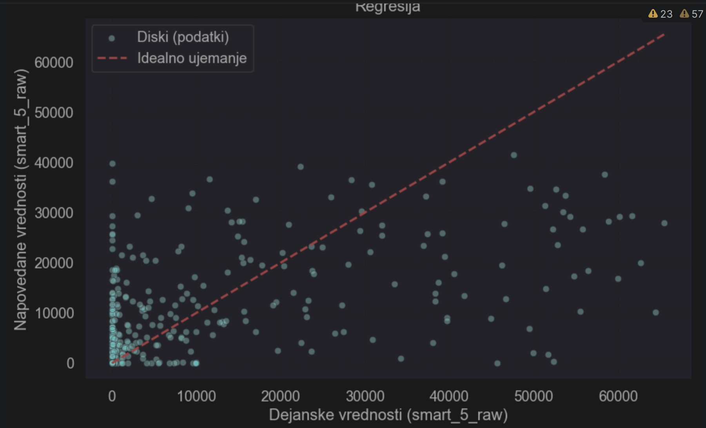
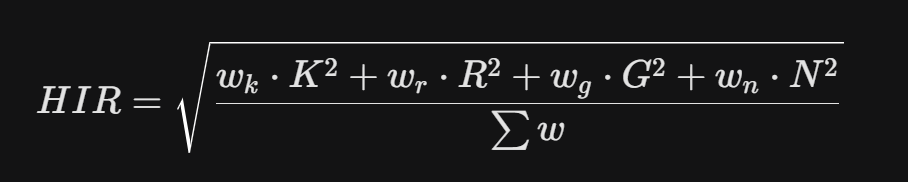

# Machine Learning - Hard Drive Failure Prediction Model

A machine learning project that predicts hard drive failures using historical **SMART** (Self-Monitoring, Analysis, and Reporting Technology) sensor data. The system combines two deep learning anomaly detection implementations built on TensorFlow/Keras, a classical sklearn pipeline with Random Forest classification, regression and unsupervised clustering, a reusable real-time prediction pipeline, and a local AI assistant for result interpretation.

By learning disk degradation patterns, the model identifies risks before critical hardware failure and data loss occur.

### Key Features:
* **Dataset:** Backblaze open-source data (Year 2025).
* **Scale:** Processed 32M+ records across 365 daily CSV files.
* **Methodology:** Deep learning (Autoencoder anomaly detection + Bottleneck classifier), Supervised learning (Random Forest) and Unsupervised learning (K-Means).
* **Real-Time Prediction Pipeline:** A reusable pipeline that accepts live SMART JSON data and returns a disk health risk assessment.
* **AI Integration:** Local LLM (Llama 3 via Ollama) providing natural language explanations for SMART parameters.
* **TensorBoard:** Full training visualization — loss curves, AUC, weight histograms, and model graph.

---

## Current Project Structure

```
diskFailurePrediction/
│
├── srcML/                              # All machine learning code
│   ├── tensorflow_anomaly/             # Impl 1 — Unsupervised autoencoder
│   │   ├── train_autoencoder.py        #   Training script
│   │   ├── predict_autoencoder.py      #   Single-disk inference
│   │   ├── disk_autoencoder.keras      #   Trained model artifact
│   │   ├── disk_encoder.keras          #   Encoder-only artifact
│   │   ├── scaler.pkl                  #   Fitted StandardScaler
│   │   └── ae_metadata.json            #   Threshold + evaluation metrics
│   │
│   ├── tensorflow_classification/      # Impl 2 — Bottleneck classifier
│   │   ├── train_autoencoder.py        #   Stage 1: train feature extractor
│   │   ├── train_bottleneck_classifier.py  # Stage 2: train classifier
│   │   ├── predict_bottleneck.py       #   Single-disk inference
│   │   ├── bottleneck_experiment.py    #   Bottleneck dim sweep
│   │   ├── disk_clf_encoder.keras      #   Trained encoder artifact
│   │   ├── disk_bottleneck_classifier.keras # Trained classifier artifact
│   │   ├── clf_scaler.pkl              #   Fitted StandardScaler
│   │   ├── clf_ae_metadata.json        #   AE config (bottleneck dim)
│   │   ├── bottleneck_metadata.json    #   Threshold + evaluation metrics
│   │   └── logs/                       #   TensorBoard logs
│   │
│   ├── nn_preprocessing/               # Shared preprocessing utilities
│   │   └── preprocessing.py            #   Feature prep, CSV loading, balancing
│   │
│   ├── smart_scan_model.ipynb          # sklearn model notebook
│   ├── disk_pipeline.py                # Reusable sklearn prediction pipeline
│   └── disk_health_pipeline.pkl        # Serialized sklearn pipeline
│
├── backend/                            # FastAPI inference server
├── frontend/                           # React/Vite dashboard
├── csv/                                # Prepared datasets
│   └── vseOdpovedi.csv                 #   All 4,414 failure records (2025)
├── DiskJson/                           # Example SMART scan JSON inputs
│   └── disk_data_sda.json
└── Graphs/                             # Evaluation graphs for README
```

---

---

# Neural Network Implementations (TensorFlow / Keras)

These two implementations are the more advanced and accurate anomaly detection methods. Both are trained on the Backblaze 2025 dataset and use the same shared preprocessing pipeline (`nn_preprocessing`).

---

## Implementation 1 — Autoencoder Anomaly Detection (Unsupervised)

The autoencoder is trained **exclusively on healthy disks**. It learns to reconstruct normal SMART patterns. When a failing disk is passed through the model, reconstruction error spikes above the learned threshold — flagging it as an anomaly.

* **Training:** Only healthy disk rows are used. Failure rows are reserved for evaluation only.
* **Output:** Reconstruction error score (0.0–1.0), threshold, and `ANOMALY_DETECTED` / `HEALTHY` verdict.

### Training:
```bash
python srcML/tensorflow_anomaly/train_autoencoder.py --data-dir DiskData
```

### Prediction:
```bash
python srcML/tensorflow_anomaly/predict_autoencoder.py --input DiskJson/disk_data_sda.json
```

### Architecture:


### Artifacts saved to `srcML/tensorflow_anomaly/`:
* `disk_autoencoder.keras` — full autoencoder model
* `disk_encoder.keras` — encoder-only model
* `scaler.pkl` — fitted StandardScaler
* `ae_metadata.json` — threshold, feature columns, evaluation metrics

---

## Implementation 2 — Bottleneck Classifier (Supervised)

A two-stage approach recommended for higher accuracy when labeled failure data is available:

1. **Stage 1 — Autoencoder as feature extractor:** A dedicated autoencoder compresses 19 SMART features down to an **8-dimensional bottleneck** — the optimal dimensionality found through experimentation that balances information retention and noise removal.
2. **Stage 2 — Supervised classifier:** A feedforward neural network takes these **8 bottleneck features as input** and directly classifies disks as healthy or failure. Using the compressed bottleneck representation rather than raw SMART data forces the classifier to work with already-distilled, noise-free features, which is the key reason for its high performance.

The classifier is trained on a **balanced 50:50 dataset** — all 4,414 known failure records from `csv/vseOdpovedi.csv`, matched with an equal number of randomly sampled healthy rows.

### Performance (test set):
* **ROC-AUC:** 0.9289
* **PR-AUC:** 0.9337
* **Failure Recall:** 0.8912
* **Failure F1:** 0.8872

### Verdict levels:
* `HEALTHY` — failure probability below learned threshold (~0.28)
* `AT_RISK` — failure probability between threshold and 0.65
* `FAILURE` — failure probability above 0.65

### Training (Stage 1 — Autoencoder):
```bash
python srcML/tensorflow_classification/train_autoencoder.py --data-dir DiskData
```

### Training (Stage 2 — Classifier):
```bash
python srcML/tensorflow_classification/train_bottleneck_classifier.py --data-dir DiskData
```

### Prediction:
```bash
python srcML/tensorflow_classification/predict_bottleneck.py --input DiskJson/disk_data_sda.json
```

### Example response:
```json
{
  "failure_predicted": false,
  "failure_probability": 0.4286,
  "threshold": 0.2825,
  "high_risk_threshold": 0.65,
  "verdict": "AT_RISK",
  "bottleneck_features": [5.44, 0.0, 0.0, 0.36, 0.0, 4.67, 2.83, 0.0],
  "model_info": {
    "bottleneck_dim": 8,
    "trained_on_failure_rows": 4414,
    "failure_recall": 0.8912,
    "failure_f1": 0.8872
  }
}
```

### Architecture:

> The classifier receives the **8-dimensional bottleneck output** from the autoencoder encoder — not raw SMART data. This dim=8 was selected as the optimal bottleneck size for maximizing classifier performance.


### Artifacts saved to `srcML/tensorflow_classification/`:
* `disk_clf_autoencoder.keras` — Impl 2 autoencoder
* `disk_clf_encoder.keras` — Impl 2 encoder (used by classifier)
* `clf_scaler.pkl` — fitted StandardScaler for Impl 2
* `clf_ae_metadata.json` — bottleneck dim, feature columns
* `disk_bottleneck_classifier.keras` — trained Stage 2 classifier
* `bottleneck_metadata.json` — threshold, evaluation metrics

---

## TensorBoard

Both NN implementations log training metrics to TensorBoard. After training, launch:

```bash
# Implementation 2 classifier logs:
tensorboard --logdir "srcML/tensorflow_classification/logs"
```

Then open `http://localhost:6006` in your browser.

**Available tabs:**
* **Scalars** — loss, val_loss, AUC, val_AUC per epoch
* **Histograms** — weight and bias distributions per layer
* **Graphs** — interactive visualization of the classifier architecture

---

---

# sklearn Pipeline (Random Forest + Clustering)

* **Model Source:** [smart_scan_model.ipynb](srcML/smart_scan_model.ipynb) — *This is the core notebook where the model is trained, evaluated, and exported for real-time prediction.*
* **Reusable Prediction Pipeline:** [disk_pipeline.py](srcML/disk_pipeline.py) — *This contains the reusable preprocessing and prediction logic used by the API.*
* **Serialized Health Pipeline:** [disk_health_pipeline.pkl](srcML/disk_health_pipeline.pkl) — *This is the exported machine learning pipeline used for real-time inference.*
* **Balanced Data Selection:** [pridobivanje_podatkovne_mnozice.ipynb](srcML/pridobivanje_podatkovne_mnozice.ipynb) - *This selects all problematic disks from the whole year 2025 (only 4414), completing the dataset with another 4414 randomly selected healthy disks. This selection is functional, but not optimal yet; a more efficient sampling strategy is planned.*
* **SMART scan JSON input:** [disk_data_sda.json](DiskJson/disk_data_sda.json) - *Example SMART scan exported from smartctl in JSON format and used for testing real-time API prediction.*

---

## Real-Time Prediction API

The project now includes a **FastAPI backend** that allows real-time disk health prediction from SMART JSON data.

The API endpoint accepts a SMART JSON file, converts it into the model-compatible structure, runs preprocessing, applies the trained pipeline, and returns a health prediction result.

### Example request (currently via cli, latter will be displayed on dashboard):

bash curl -X POST "[http://localhost:8000/api/analyze-smart-json](http://localhost:8000/api/analyze-smart-json)" -H "accept: application/json" -H "Content-Type: multipart/form-data" -F "file=@disk_data_sda.json;type=application/json"

### Example response:

json { "hir_risk_score": 6.76, "verdict": "Healthy", "models_output": { "classification_fail": false, "predicted_smart_5_sectors": 9.6, "cluster_profile_id": 0 } }

### Returned values:
* **hir_risk_score:** Final disk risk score calculated from classification, regression, clustering, and critical SMART error signals.
* **verdict:** Final health category: `Healthy`, `Warning`, or `Critical`.
* **classification_fail:** Binary Random Forest classification result.
* **predicted_smart_5_sectors:** Regression prediction for SMART 5 / Reallocated Sectors Count.
* **cluster_profile_id:** K-Means cluster profile assigned to the disk.

This API is intended to be used by the dashboard application in the `frontend` folder, where real-time disk scans can be uploaded and displayed in a more user-friendly visual form.

---

### Docker services:
1. **disk-ml-backend:** FastAPI backend used for machine learning inference.
2. **disk-ml-frontend:** React/Vite frontend dashboard.
3. **Ollama / LLM service:** Local AI assistant setup, used for natural language interpretation of SMART results.

The backend loads the serialized pipeline from: 

text /app/srcML/disk_health_pipeline.pkl


The `srcML` folder is mounted into the backend container, so the latest model pipeline and preprocessing code are available to the API.

---

## Model Performance & Analysis

The model demonstrates high reliability in identifying failure-prone drives using dual-method analysis:

### 1. Classification Analysis (Yes/No)
Categorizes drives into binary states: **Healthy** or **Failure-Prone**.
* **Accuracy:** 90.15%
* **Recall:** 86.00% (Critical for capturing actual failure events)
* **F1-Score:** 0.88


### 2. Regression Analysis (SMART 5)
Predicting the value of **SMART 5 (Reallocated Sectors Count)**.
* **Predictive Forecasting:** Instead of a binary "Yes/No", the model predicts the *actual number* of reallocated sectors.
* **Surface Degradation:** By predicting a rise in SMART 5, we can intervene before the disk's internal spare area is fully depleted.
* **Failure Urgency:** A higher predicted SMART 5 value correlates directly with imminent mechanical failure.



---

### Top Predictors (Feature Importance):
The following SMART attributes were identified as the strongest indicators of failure:
1. **SMART 5** (Reallocated Sectors Count)
2. **SMART 187** (Reported Uncorrectable Errors)
3. **SMART 188** (Command Timeout)
4. **SMART 197** (Current Pending Sector Count)

---

## Clustering Analysis

Using the **K-Means** algorithm and **t-SNE** visualization (Euclidean distance), drives are categorized into 3 distinct groups:

* **Cluster 0:** Healthy drives (Optimal operation).
* **Cluster 1:** Aging drives (Increased power-on hours/usage).
* **Cluster 2:** Critical drives (High probability of failure due to critical SMART errors).


---

### Example - Graph Risk Profile Interpretation for most critical disk

To demonstrate the efficacy of our risk assessment, we present two extreme instances (hard drives) from the dataset. This visual comparison illustrates how various machine learning methods and two key attributes contribute to the final prediction.


**High-Risk Instance (97%):** We observe a high level of convergence across all modules. Each machine learning method (classification, regression, and clustering) predicts values close to 1.0. This alignment confirms that the 97% risk score is highly accurate and reliable, as it is corroborated by multiple independent models simultaneously.


**Low-Risk Instance (5%):** In contrast, we see a consistent prediction near 0.0 across all security-related modules. The only significant value is Age (0.8), proving that the model can effectively isolate natural wear and tear from actual failure signals.

**Formula for prediction calculation:** The HIR score is the weighted root-mean-square of four critical metrics ($K, R, G, N$), combining them into a single value that heavily penalizes large health deviations to predict imminent disk failure:



---

## Branches

**main branch:** whole setup is running locally on my TrueNAS server via Portainer (LLM Llama 3).

**laptopVersion branch:** modified model and app.py for using better GPU and CPU of my laptop (LLM mistral-nemo:12b).
