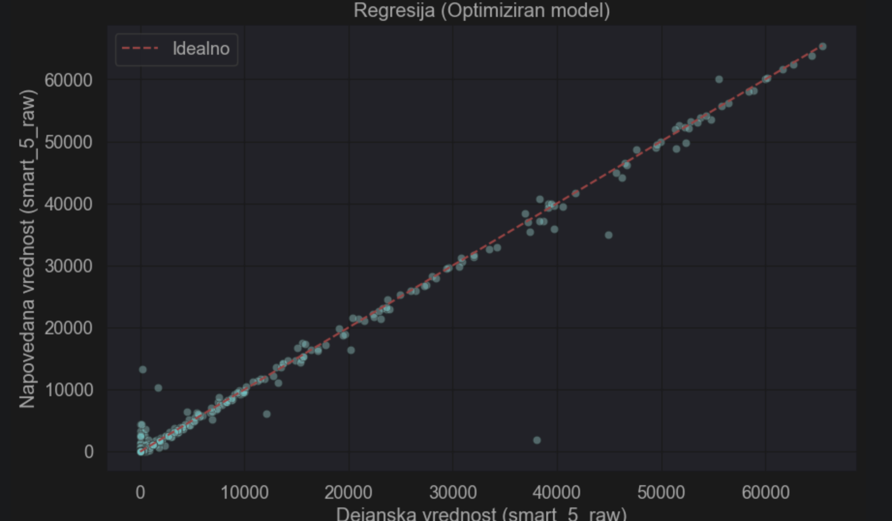
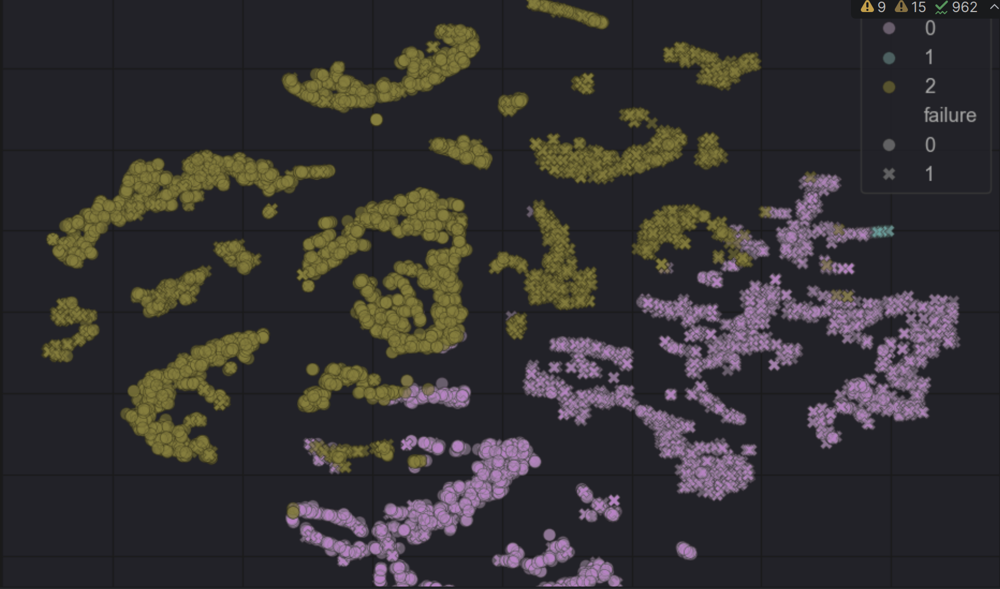
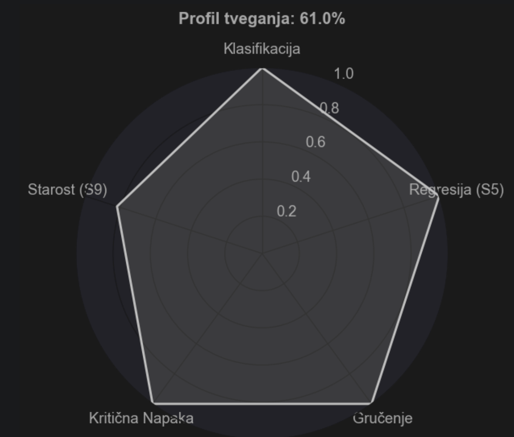
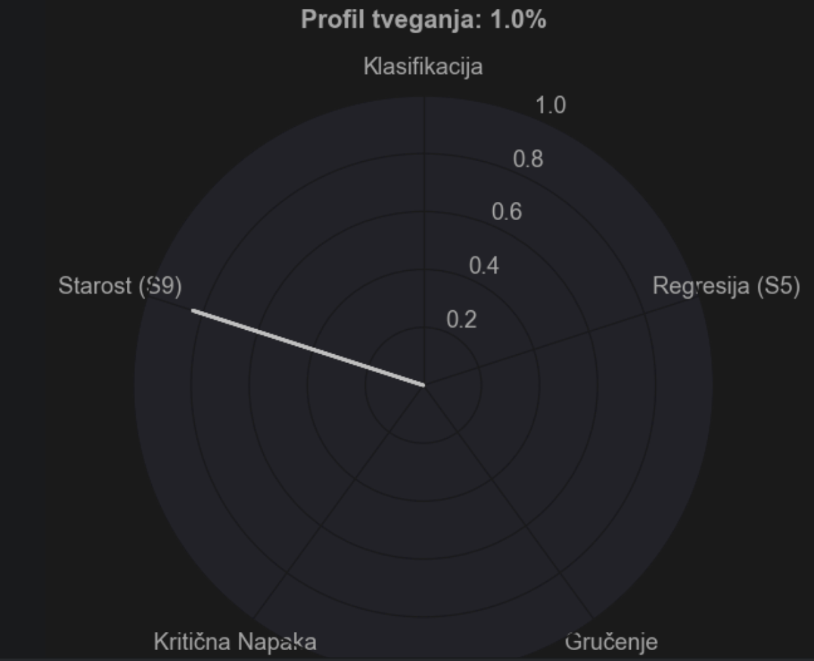
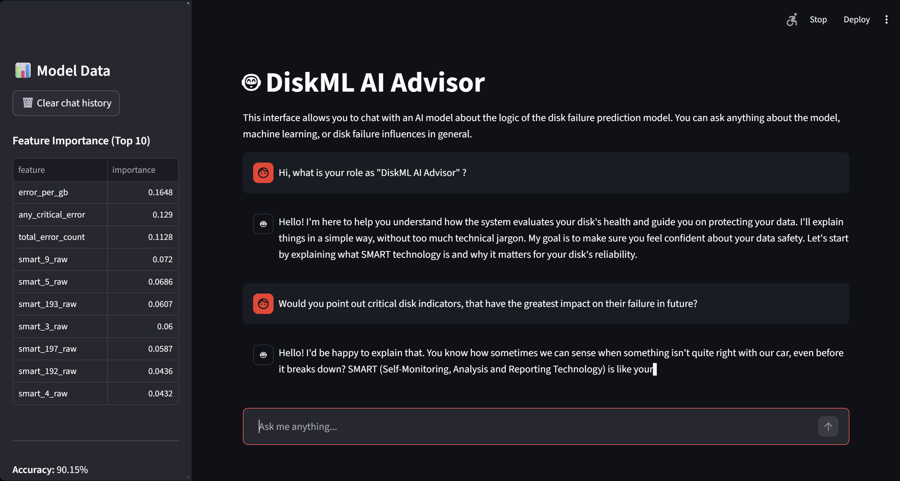

# Machine Learning - Hard Drive Failure Prediction Model & AI Assistant

A machine learning project that predicts hard drive failures using historical **SMART** (Self-Monitoring, Analysis, and Reporting Technology) sensor data. This system integrates Random Forest classification, regression, unsupervised clustering, and a local AI assistant for result interpretation. 

By learning disk degradation patterns, the model identifies risks before critical hardware failure and data loss occur.

### Key Features:
* **Dataset:** Backblaze open-source data (Year 2025).
* **Scale:** Processed 32M+ records, filtered into a balanced dataset of **8,828 instances**.
* **Methodology:** Supervised learning (Random Forest - regression and classification) and Unsupervised learning (K-Means).
* **AI Integration:** Local LLM (Llama 3 via Ollama) providing natural language explanations for SMART parameters.

---

* **Model Source:** [smart_scan_model.ipynb](srcML/smart_scan_model.ipynb) — *This is the core model that predicts failures and provides the analytical results.*
* **Balanced Data Selection:** [pridobivanje_podakotvne_mnozice](srcML/pridobivanje_podatkovne_mnozice.ipynb) - *This selects all problematic disks from whole year 2025 (only 4414), completing the dataset with other 4414 randomly selected disks (not optimal, the more efficient selection is to be implemented)*
* **Smart scan to json:** [smart_scan_to_json.ipynb](srcML/smart_scan_to_json.ipynb) - *This is script that converts terminal SMART scan to a .scv format that fits the dataset structure of the model, meant to test the model on practical disk data*

---

## Technical Architecture
The project is deployed in an isolated **Docker** environment on **TrueNAS SCALE**, ensuring data privacy and system stability.

### System Components:
1.  **ML Model:** Random Forest Classifier trained on 19 statistically significant SMART attributes.
2.  **Streamlit UI:** A web dashboard for AI chat interaction.
3.  **Ollama Service:** Local inference engine running the Llama 3 model (mistral-nemo:12b on other branch, meant for laptop).
4.  **Data Pipeline:** Automated preprocessing, median imputation, and feature scaling.

---

## Model Performance & Analysis

The model demonstrates high reliability in identifying failure-prone drives using dual-method analysis:

### 1. Classification Analysis (Yes/No)
Categorizes drives into binary states: **Healthy** or **Failure-Prone**.
* **Accuracy:** 90.15%
* **Recall:** 86.00% (Critical for capturing actual failure events)
* **F1-Score:** 0.88

### 2. Regression Analysis (SMART 5)
Predicting the value of **SMART 5 (Reallocated Sectors Count)**.
* **Predictive Forecasting:** Instead of a binary "Yes/No", the model predicts the *actual number* of reallocated sectors.
* **Surface Degradation:** By predicting a rise in SMART 5, we can intervene before the disk's internal spare area is fully depleted.
* **Failure Urgency:** A higher predicted SMART 5 value correlates directly with imminent mechanical failure.

---

### Top Predictors (Feature Importance):
The following SMART attributes were identified as the strongest indicators of failure:
1.  **SMART 5** (Reallocated Sectors Count)
2.  **SMART 187** (Reported Uncorrectable Errors)
3.  **SMART 188** (Command Timeout)
4.  **SMART 197** (Current Pending Sector Count)

---

## Clustering Analysis
Using the **K-Means** algorithm and **t-SNE** visualization (Euclidean distance), drives are categorized into 3 distinct groups:
* **Cluster 0:** Healthy drives (Optimal operation).
* **Cluster 1:** Aging drives (Increased power-on hours/usage).
* **Cluster 2:** Critical drives (High probability of failure due to critical SMART errors).

---

### Example - Graph Risk Profile Interpretation for most critical disk

To demonstrate the efficacy of our risk assessment, we present two extreme instances (hard drives) from the dataset. This visual comparison illustrates how various machine learning methods and two key attributes contribute to the final prediction.

**High-Risk Instance (61%):** We observe a high level of convergence across all modules. Each machine learning method (classification, regression, and clustering) predicts values close to 1.0. This alignment confirms that the 61% risk score is highly accurate and reliable, as it is corroborated by multiple independent models simultaneously.

**Low-Risk Instance (1%):** In contrast, we see a consistent prediction near 0.0 across all security-related modules. The only significant value is Age (0.8), proving that the model can effectively isolate natural wear and tear from actual failure signals.

---

## Chat interface

---

main branch : whole setup is running localy on my treunas server via portainer (LLM llama3)

laptopVersion branch : modified model and app.py for using better gpu and cpu of my laptop (LLM mistral-nemo:12b)
