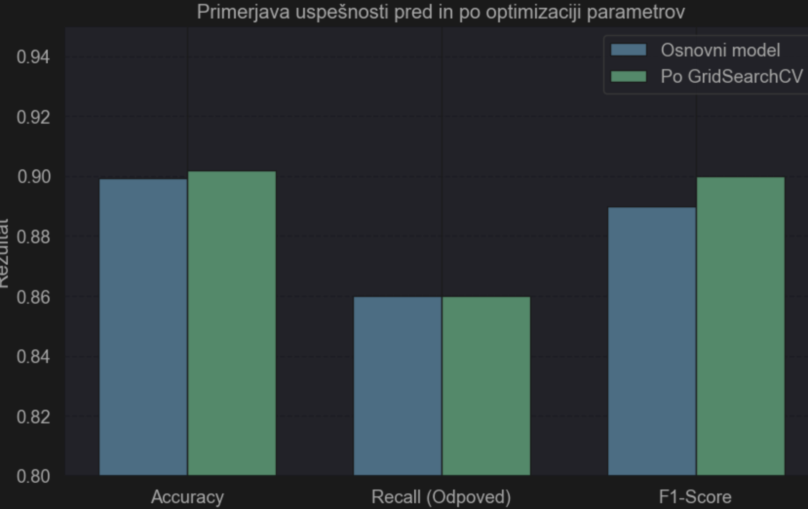
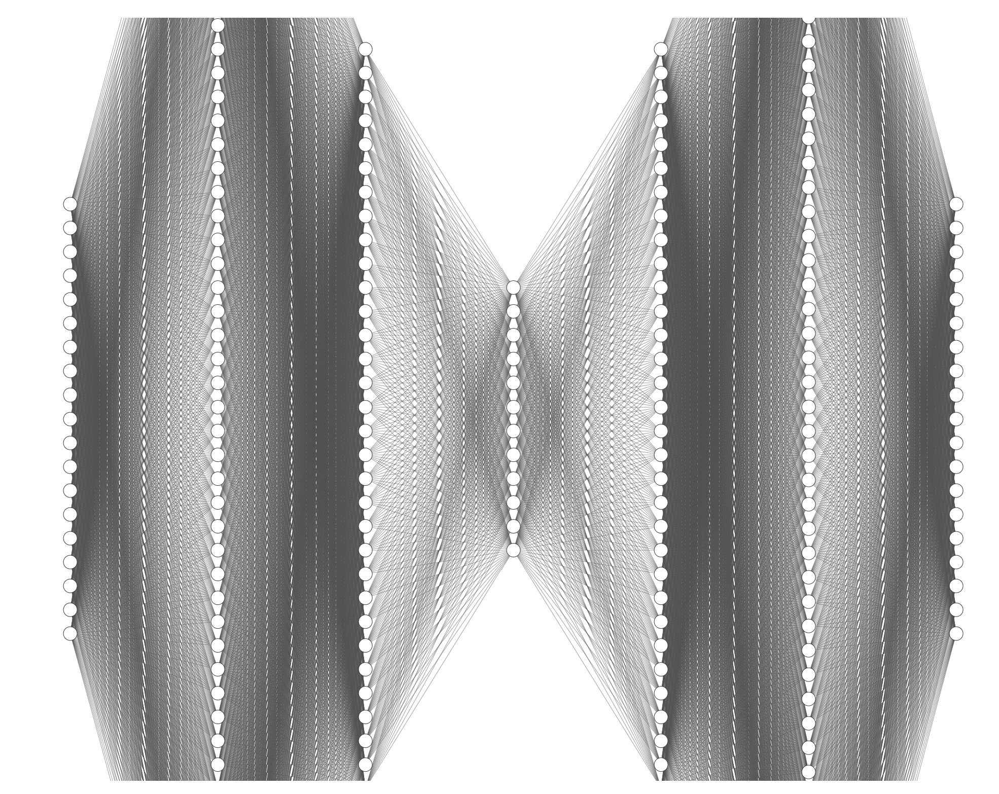
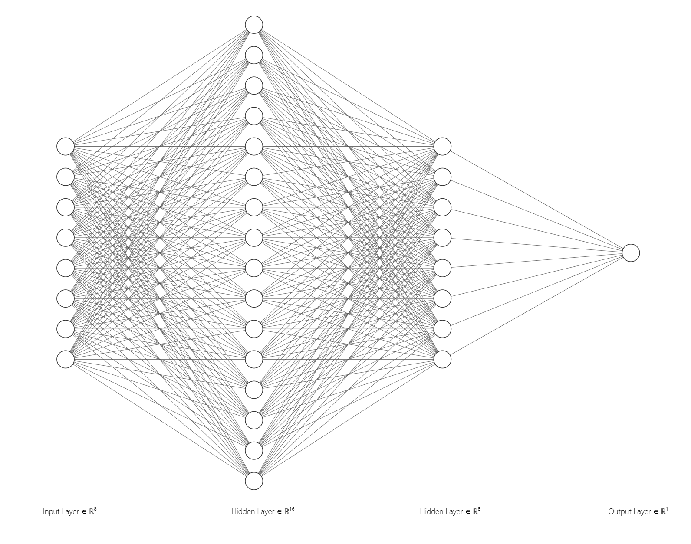
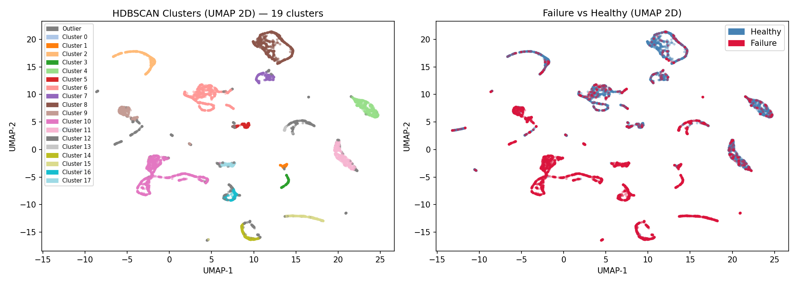
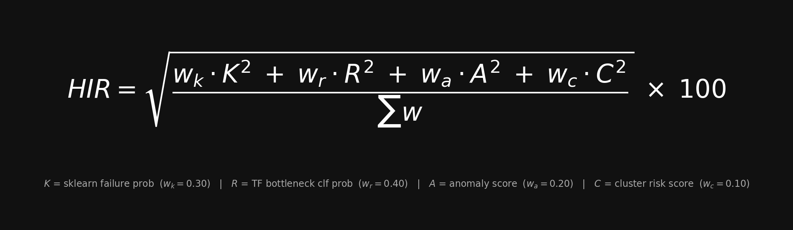

# Hard Drive Failure Prediction — Multi-Model Health Index Rating

A machine learning system that predicts hard drive failures from real-time **SMART** sensor data. Four independent models — spanning supervised deep learning, unsupervised anomaly detection, and density-based clustering — are fused into a single interpretable score: the **Health Index Rating (HIR)**.

Built on the [Backblaze 2025](https://www.backblaze.com/cloud-storage/resources/hard-drive-test-data) open dataset: **32M+ records**, **365 daily CSV files**, **4,414 confirmed failure events**.

- 🎯 **89.1% failure recall** — catches 9 out of 10 failing disks before they die
- 🔀 **4 ML techniques, one final score** — RF, deep AE, bottleneck classifier and HDBSCAN each vote independently; results fused into a single HIR verdict
- 📦 **32M+ real-world sensor records** — trained on a full year of Backblaze production fleet data, not synthetic benchmarks
- 🪶 **Lightweight inference** — runs on CPU, no GPU required; suitable for embedded systems, NAS devices, and edge deployments
- ⚡ **Instant real-time prediction** — plug in any `smartctl -j` JSON output, get a risk score and verdict in seconds
- 🔒 **Fully offline** — no cloud, no telemetry, no data leaves the machine
- 🌐 **Full-stack** — FastAPI backend + React dashboard + TensorBoard, all in one `docker compose up`

---

## Model Performance Summary

| Implementation | Method | ROC-AUC | Failure Recall | HIR Weight |
|---|---|---|---|---|
| **Impl 0** — Sklearn RF | Random Forest (19 SMART features) | — | 86.0 % | 0.30 |
| **Impl 1** — Anomaly AE | Unsupervised Autoencoder (12-dim bottleneck) | 0.901 | 44.7 % | 0.20 |
| **Impl 2** — Bottleneck Clf | AE encoder → 8-dim → Supervised Classifier | **0.929** | **89.1 %** | **0.40** |
| **Impl C** — HDBSCAN | UMAP + density clustering (18 clusters) | — | — | 0.10 |

> Impl 2 carries the highest weight — it achieves the best balance of precision and recall while being trained on a perfectly balanced dataset (4,414 failures : 4,414 healthy).

---

## Project Structure

```
diskFailurePrediction/
│
├── srcML/                              # All ML code and trained artifacts
│   ├── sklearn/                        # Impl 0 — Random Forest pipeline
│   │   ├── disk_pipeline.py            #   Preprocessing + DiskHealthPipeline class
│   │   ├── disk_health_pipeline.pkl    #   Serialized trained pipeline
│   │   └── smart_scan_model.ipynb      #   Training notebook (RF + regression analysis)
│   ├── tensorflow_anomaly/             # Impl 1 — Unsupervised autoencoder
│   │   ├── train_autoencoder.py        #   Training script (healthy-only)
│   │   ├── predict_autoencoder.py      #   Single-disk inference
│   │   ├── disk_autoencoder.keras      #   Trained model
│   │   ├── tf_scaler.pkl               #   Fitted StandardScaler
│   │   ├── tf_metadata.json            #   Threshold + evaluation metrics
│   │   └── logs/                       #   TensorBoard training logs
│   ├── tensorflow_classification/      # Impl 2 — Bottleneck classifier (2-stage)
│   │   ├── train_autoencoder.py        #   Stage 1: train feature extractor AE
│   │   ├── train_bottleneck_classifier.py  # Stage 2: train supervised classifier
│   │   ├── predict_bottleneck.py       #   Single-disk inference
│   │   ├── disk_clf_encoder.keras      #   Encoder artifact (shared with clustering)
│   │   ├── disk_bottleneck_classifier.keras
│   │   ├── clf_scaler.pkl
│   │   ├── bottleneck_metadata.json    #   Thresholds + evaluation metrics
│   │   └── logs/                       #   TensorBoard training logs
│   ├── tensorflow_clustering/          # Impl C — UMAP + HDBSCAN
│   │   ├── umap_hdbscan.py             #   Training + TensorBoard Projector export
│   │   ├── clf_hdbscan.pkl             #   Trained HDBSCAN model
│   │   ├── hdbscan_metadata.json       #   18 clusters + per-cluster failure rates
│   │   └── logs/                       #   TensorBoard Embedding Projector logs
│   ├── nn_preprocessing/
│   │   └── preprocessing.py            #   Shared feature prep, CSV loading, dataset balancing
│   └── hir_final.py                    #   ★ Final HIR scoring — combines all 4 models
│
├── backend/                            # FastAPI inference server
├── frontend/                           # React + Vite dashboard
├── DiskJson/                           # Example smartctl JSON inputs for testing
├── Graphs/                             # All evaluation plots (auto-generated)
├── csv/                                # Prepared datasets (vseOdpovedi.csv — all 4,414 failures)
└── docker-compose.yaml                 # backend + frontend + TensorBoard (port 6006)
```

---

## Implementation 0 — Random Forest (Sklearn)

A classical supervised pipeline trained in [`smart_scan_model.ipynb`](srcML/sklearn/smart_scan_model.ipynb) on 19 SMART attributes plus manufacturer encoding. Serves as a strong and interpretable baseline.

**Top failure predictors by feature importance:**
1. SMART 5 — Reallocated Sectors Count
2. SMART 187 — Reported Uncorrectable Errors
3. SMART 188 — Command Timeout
4. SMART 197 — Current Pending Sector Count

**Performance:** Accuracy 90.15% · Recall 86.0% · F1 0.88




---

## Implementation 1 — Autoencoder Anomaly Detection (Unsupervised)

The autoencoder is trained **exclusively on 292,000 healthy disk rows**. It learns to reconstruct normal SMART patterns. When a degraded disk is passed through the network, reconstruction error spikes above the learned 99th-percentile threshold — flagging it as an anomaly without ever having seen a failure during training.

**Architecture:** 19 → 64 → 32 → **12** (bottleneck) → 32 → 64 → 19

**Evaluation on held-out failure rows (after optimisation, converged at epoch 37/60):**
- ROC-AUC: **0.901** · PR-AUC: **0.600** · Failure detection rate: **44.7%** at 1% false-positive rate
- Failure F1: **0.555** · Failure precision: **0.730** — a 71% improvement in F1 vs. the baseline run
- Healthy precision: 96.7% — the model remains highly conservative to avoid false alarms



```bash
python srcML/tensorflow_anomaly/train_autoencoder.py --data-dir DiskData
python srcML/tensorflow_anomaly/predict_autoencoder.py --input DiskJson/disk_data_sda.json
```

---

## Implementation 2 — Bottleneck Classifier (Supervised, 2-stage)

The strongest individual signal in the ensemble. A two-stage pipeline where a dedicated autoencoder first compresses the 19 SMART features into an **8-dimensional bottleneck** (optimal dimensionality determined empirically), and a supervised feedforward classifier then acts on those distilled, noise-reduced features.

Training used a perfectly balanced 50:50 split: all **4,414 confirmed failures** against an equal number of healthy rows.

| Metric | Value |
|---|---|
| ROC-AUC | **0.9289** |
| PR-AUC | **0.9337** |
| Failure Recall | **89.1 %** |
| Failure F1 | **88.7 %** |
| Accuracy | 88.7 % |

> Convergence at epoch 68/100 (early stopping) — no signs of overfitting on the balanced test set.



```bash
python srcML/tensorflow_classification/train_autoencoder.py --data-dir DiskData
python srcML/tensorflow_classification/train_bottleneck_classifier.py --data-dir DiskData
python srcML/tensorflow_classification/predict_bottleneck.py --input DiskJson/disk_data_sda.json
```

---

## Implementation C — UMAP + HDBSCAN Clustering (Unsupervised)

Density-based clustering directly on the **8-dim bottleneck representation** from Impl 2's encoder. UMAP reduces the space for visualization; HDBSCAN clusters in the full 8-dim space without requiring a pre-specified cluster count.

**Result: 18 natural clusters** discovered, each assigned an empirical failure rate from the training set. Outlier points (13.67% of data) show a **66.9% failure rate** — significantly above the dataset average — making cluster membership a meaningful risk signal on its own.



```bash
python srcML/tensorflow_clustering/umap_hdbscan.py --data-dir DiskData
```

---

## Health Index Rating (HIR) - Clean and final result

All four models are fused into a single score using a **weighted root-mean-square** formula. RMS is preferred over a linear average because it amplifies large individual signals — a disk that looks catastrophic on one axis cannot be "averaged away" by healthy scores elsewhere.



| Symbol | Source | Weight |
|---|---|---|
| K | Sklearn RF failure probability | 0.30 |
| R | TF Bottleneck Classifier probability | **0.40** |
| A | Anomaly AE normalized score | 0.20 |
| C | HDBSCAN cluster failure rate | 0.10 |

Score clamped to **[3, 97]** · Verdicts: **HEALTHY** < 40 · **WARNING** 40–75 · **CRITICAL** > 75

### Run on any disk:
```bash
# Export SMART data
smartctl -A -i /dev/sda -j > disk_data.json

# Score with all four models
python srcML/hir_final.py --input disk_data.json
```

### Example output:
```json
{
  "hir_score": 33.43,
  "verdict": "HEALTHY",
  "components": {
    "sklearn_failure_prob": 0.2106,
    "tf_clf_failure_prob": 0.4286,
    "anomaly_score": 0.0,
    "cluster_risk_score": 0.133
  }
}
```

---

## API & Frontend

The **FastAPI backend** exposes a `/api/analyze-smart-json` endpoint that accepts a raw `smartctl -j` JSON file and returns the full HIR result. The **React/Vite frontend** provides a dashboard for uploading scans and visualising results.

```bash
curl -X POST http://localhost:8000/api/analyze-smart-json \
  -F "file=@disk_data.json;type=application/json"
```

---

## TensorBoard

All three NN training runs log to their respective `logs/` directories. A dedicated TensorBoard container is included in `docker-compose.yaml` with named log streams:

```bash
docker compose up          # starts backend + frontend + tensorboard
# → http://localhost:6006  (anomaly / classification / clustering tabs)
```

Available views: **Scalars** (loss, AUC per epoch) · **Histograms** (weight distributions) · **Graphs** (model topology) · **Projector** (clustering: 8-dim bottleneck embeddings colored by cluster and failure label)

---

## Stack

`TensorFlow / Keras` · `scikit-learn` · `UMAP-learn` · `HDBSCAN` · `FastAPI` · `React + Vite` · `Docker`

---
